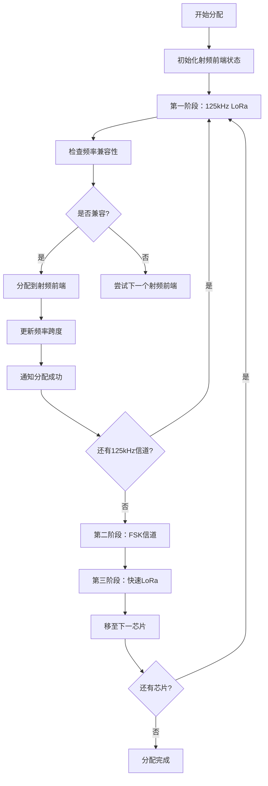

# RAL (Radio Abstraction Layer) 无线电抽象层技术详解

## 📋 目录
- [概述](#概述)
- [设计架构](#设计架构)
- [核心模块](#核心模块)
- [实现模式](#实现模式)
- [信道分配算法](#信道分配算法)
- [主从进程架构](#主从进程架构)
- [时间同步机制](#时间同步机制)
- [错误处理与恢复](#错误处理与恢复)
- [性能优化](#性能优化)
- [常见问题](#常见问题)

## 🎯 概述

RAL(Radio Abstraction Layer)是BasicStation的无线电抽象层，为上层应用提供统一的LoRa硬件接口，隐藏不同硬件平台的差异。RAL支持多种硬件配置和运行模式，能够管理多个SX130X芯片，提供高可靠性的无线电控制。

### 核心功能
- **硬件抽象**: 为SX1301/SX1302系列芯片提供统一接口
- **多芯片管理**: 支持多个无线电芯片的并行控制
- **信道分配**: 智能分配上行信道到硬件资源
- **时间同步**: 精确的硬件时间同步机制
- **进程隔离**: 主从进程架构提高系统稳定性
- **故障恢复**: 自动检测和恢复硬件故障

### 支持的硬件
- SX1301系列LoRa网关芯片
- SX1302系列LoRa网关芯片  
- 多芯片并行配置
- 仿真模式（用于测试）

## 🏗️ 设计架构

RAL采用分层设计，从下到上包括：

```
┌─────────────────────────────────────┐
│          应用层 (S2E协议栈)           │
├─────────────────────────────────────┤
│          RAL统一接口层               │  ← ral.h
├─────────────────────────────────────┤
│  本地模式  │      主从进程模式         │  ← ral_lgw.c | ral_master.c
├─────────────────────────────────────┤
│          通用算法层                  │  ← ral.c (信道分配)
├─────────────────────────────────────┤
│        libloragw驱动库              │
├─────────────────────────────────────┤
│       SX130X硬件芯片                │
└─────────────────────────────────────┘
```

### 设计原则

1. **接口统一**: 无论底层硬件如何变化，上层接口保持一致
2. **模式灵活**: 支持本地直控和主从进程两种运行模式
3. **资源高效**: 智能分配硬件资源，最大化利用率
4. **故障隔离**: 进程间隔离避免单点故障影响整体系统
5. **时间精确**: 提供微秒级的时间同步精度

## 🔧 核心模块

### ral.h - 统一接口定义
```c
// 核心接口函数
int   ral_config(str_t hwspec, u4_t cca_region, char* json, int jsonlen, chdefl_t* upchs);
int   ral_tx(txjob_t* txjob, s2ctx_t* s2ctx, int nocca);
int   ral_txstatus(u1_t txunit);
void  ral_txabort(u1_t txunit);
int   ral_challoc(chdefl_t* upchs, challoc_cb alloc_cb, void* ctx);
int   ral_getTimesync(u1_t pps_en, sL_t* last_xtime, timesync_t* timesync);
```

### ral.c - 通用算法实现
- **信道分配算法**: `ral_challoc()`
- **硬件约束管理**: 频率范围和调制解调器限制
- **优化策略**: 三阶段分配提高资源利用率

### ral_lgw.c - 本地模式实现
- **直接硬件控制**: 无进程间开销
- **简单配置**: 适用于单芯片场景
- **实时性好**: 响应延迟最低

### ral_master.c - 主从模式主进程
- **多进程管理**: 管理多个从进程
- **通信协调**: 处理进程间消息传递
- **故障恢复**: 自动重启异常从进程

### ral_slave.c - 主从模式从进程
- **硬件专控**: 每个从进程控制一个芯片
- **隔离运行**: 避免进程间相互影响
- **协议实现**: 实现主从通信协议

## ⚙️ 实现模式

RAL提供两种实现模式，通过编译时配置选择：

### 本地模式 (CFG_ral_lgw)
```c
// 特点：
- 单进程直接控制硬件
- 适用于单芯片或简单配置
- 最低延迟和开销
- 调试简单

// 适用场景：
- 单SX130X芯片配置
- 对实时性要求极高的场景
- 资源受限的嵌入式环境
- 开发调试阶段
```

### 主从模式 (CFG_ral_master_slave)  
```c
// 特点：
- 多进程架构，主进程协调，从进程控制硬件
- 支持多芯片并行管理
- 故障隔离和自动恢复
- 更高的系统稳定性

// 适用场景：
- 多SX130X芯片配置
- 高可靠性要求
- 复杂的无线电配置
- 生产环境部署
```

### 模式选择建议

| 场景 | 推荐模式 | 原因 |
|------|----------|------|
| 单芯片基站 | 本地模式 | 简单高效，延迟最低 |
| 多芯片基站 | 主从模式 | 并行管理，故障隔离 |
| 开发调试 | 本地模式 | 调试方便，问题定位容易 |
| 生产部署 | 主从模式 | 稳定性高，自动恢复 |
| 资源受限 | 本地模式 | 内存占用少，开销小 |

## 🎛️ 信道分配算法

信道分配是RAL的核心算法，负责将逻辑信道映射到物理硬件资源。

### 硬件约束

每个SX130X芯片包含：
- **2个射频前端(RFF)**: 每个RFF覆盖一定的频率范围
- **10个调制解调器**: 0-7号用于125kHz LoRa，8号用于快速LoRa，9号用于FSK
- **频率偏移限制**: 不同带宽有不同的最大偏移量

```c
// 频率偏移限制
#define SX130X_RFE_MAXCOFF_125 400000   // 125kHz: ±400kHz
#define SX130X_RFE_MAXCOFF_250 375000   // 250kHz: ±375kHz  
#define SX130X_RFE_MAXCOFF_500 300000   // 500kHz: ±300kHz
```

### 三阶段分配策略

#### 第一阶段：125kHz LoRa信道
- **优先级**: 最高，因为带宽小，容易安排
- **调制解调器**: 使用0-7号
- **策略**: 尽可能多地分配到每个芯片
- **频率约束**: 最宽松的±400kHz偏移

#### 第二阶段：FSK信道
- **调制解调器**: 固定使用9号
- **策略**: 每个芯片最多一个FSK信道
- **频率约束**: 较宽松，2×400kHz范围

#### 第三阶段：快速LoRa信道
- **调制解调器**: 固定使用8号
- **策略**: 每个芯片最多一个快速LoRa信道
- **频率约束**: 最严格，±375kHz或±300kHz

### 分配流程



### 优化策略

1. **频率范围最小化**: 动态调整射频前端中心频率
2. **负载均衡**: 尽量平均分配信道到各芯片
3. **兼容性优先**: 优先选择频率兼容性好的组合
4. **资源利用最大化**: 避免硬件资源浪费

## 🔄 主从进程架构

主从进程架构是RAL的高级功能，提供更高的可靠性和扩展性。

### 架构组成

```
主进程 (ral_master.c)
├── 业务逻辑处理
├── 从进程生命周期管理
├── 进程间通信协调
└── 故障检测与恢复

从进程群
├── 从进程#0 (芯片#0) ──┐
├── 从进程#1 (芯片#1)   │── 各自独立运行
└── 从进程#N (芯片#N) ──┘
```

### 通信协议

主从进程通过管道进行通信，使用结构化的消息协议：

```c
// 命令类型
enum {
    RAL_CMD_CONFIG = 1,    // 配置命令
    RAL_CMD_TXSTATUS,      // 查询发送状态
    RAL_CMD_TXABORT,       // 中止发送
    RAL_CMD_TX,            // 发送数据
    RAL_CMD_RX,            // 接收数据通知
    RAL_CMD_TIMESYNC,      // 时间同步
    RAL_CMD_STOP,          // 停止命令
};

// 消息结构
struct ral_header {
    sL_t rctx;             // 上下文(通常是从进程ID)
    u1_t cmd;              // 命令类型
};
```

### 生命周期管理

#### 从进程启动
1. 主进程调用`fork()`创建子进程
2. 子进程调用`execSlave()`设置环境
3. 创建双向管道建立通信
4. 发送配置信息到从进程
5. 从进程初始化硬件并响应

#### 状态监控
- **定期检查**: 每500ms检查从进程状态
- **心跳机制**: 通过时间同步请求作为心跳
- **异常检测**: 监控管道状态和进程退出

#### 故障恢复
- **温和终止**: 先发送SIGTERM信号
- **强制杀死**: 如果温和终止失败，发送SIGKILL
- **自动重启**: 清理旧资源，创建新进程
- **重试限制**: 防止无限重启循环

### 数据流处理

#### 上行数据(从进程 → 主进程)
```c
// 接收数据包处理流程
1. 从进程调用lgw_receive()获取数据
2. 转换为RAL格式的接收消息
3. 通过上行管道发送给主进程
4. 主进程接收并添加到S2E接收队列
5. 刷新给上层应用处理
```

#### 下行数据(主进程 → 从进程)  
```c
// 发送数据包处理流程
1. 上层调用ral_tx()发送数据
2. 主进程构造发送命令消息
3. 通过下行管道发送给对应从进程
4. 从进程调用lgw_send()执行发送
5. 返回发送结果给主进程
```

## ⏰ 时间同步机制

精确的时间同步是LoRaWAN基站的关键功能，RAL提供微秒级的时间同步精度。

### 时间体系

RAL使用xtime时间格式，编码了完整的时间和上下文信息：

```c
// xtime时间戳编码 (64位)
// 位63:    符号位(总是正数)
// 位62-56: 无线电单元编号(最大128个)
// 位55-48: 会话编号(区分不同启动会话)
// 位47-0:  硬件启动后的微秒数
```

### 同步策略

#### 本地模式同步
```c
int ral_getTimesync(u1_t pps_en, sL_t* last_xtime, timesync_t* timesync) {
    ustime_t t0 = rt_getTime();           // 测量开始时间
    u4_t xticks = 0;
    lgw_get_trigcnt(&xticks);             // 读取硬件计数器
    ustime_t t1 = rt_getTime();           // 测量结束时间
    
    // 计算时间差作为质量指标
    int quality = (int)(t1-t0);
    
    // 构建64位连续时间
    sL_t d = (s4_t)(xticks - *last_xtime);
    timesync->xtime = *last_xtime += d;
    timesync->ustime = (t0+t1)/2;         // MCU时间取中点
    
    return quality;
}
```

#### 主从模式同步
- **定期请求**: 主进程定期向从进程请求时间同步
- **质量评估**: 根据测量质量调整下次同步间隔
- **PPS支持**: 支持GPS PPS信号的高精度同步
- **多进程协调**: 确保所有从进程时间一致

### PPS支持

当启用PPS(Pulse Per Second)功能时：
- **GPS锁存**: GPS每秒脉冲锁存硬件计数器
- **时间校准**: 使用GPS时间校准本地时钟
- **精度提升**: 实现纳秒级的时间精度
- **故障检测**: 检测PPS信号丢失并处理

## 🛠️ 错误处理与恢复

RAL实现了多层次的错误处理和恢复机制。

### 错误分类

#### 硬件错误
- **芯片通信失败**: SPI通信错误
- **配置错误**: 硬件配置失败
- **发送失败**: 发送命令执行失败
- **时间同步失败**: 时间戳读取失败

#### 进程错误
- **从进程崩溃**: 从进程异常退出
- **管道断开**: 进程间通信失败
- **超时错误**: 命令响应超时
- **资源耗尽**: 内存或文件描述符不足

#### 配置错误
- **JSON解析失败**: 配置格式错误
- **参数无效**: 配置参数超出范围
- **硬件不匹配**: 配置与硬件不符
- **信道分配失败**: 无法分配信道到硬件

### 恢复策略

#### 自动重启
```c
// 从进程重启逻辑
static void restart_slave(tmr_t* tmr) {
    slave_t* slave = memberof(slave_t, tmr, tmr);
    
    // 防止频繁重启
    if(++slave->restartCnt > 4) {
        rt_fatal("Slave restarted too many times");
    }
    
    // 清理旧进程
    if(is_slave_alive(slave)) {
        kill(slave->pid, slave->killCnt <= 2 ? SIGTERM : SIGKILL);
        slave->killCnt++;
        // 稍后重试
        rt_setTimer(&slave->tmr, rt_micros_ahead(RETRY_KILL_INTV));
        return;
    }
    
    // 创建新进程
    create_new_slave_process(slave);
}
```

#### 优雅降级
- **部分功能继续**: 即使某些芯片故障，其他芯片继续工作
- **备用信道**: 使用备用信道维持基本功能
- **降低性能**: 临时降低处理能力避免崩溃
- **用户通知**: 记录详细日志供后续分析

#### 资源保护
- **内存监控**: 监控内存使用，防止泄漏
- **文件描述符管理**: 及时关闭不用的文件描述符
- **定时器清理**: 清理过期的定时器
- **管道缓冲区管理**: 防止管道阻塞

## 🚀 性能优化

RAL在设计时考虑了多个性能优化点。

### 通信优化

#### 批量处理
- **接收数据**: 一次读取多个数据包
- **管道通信**: 批量发送命令减少系统调用
- **内存复制**: 减少不必要的内存复制操作

#### 异步处理
```c
// 异步IO处理
static void pipe_read(aio_t* aio) {
    slave_t* slave = (slave_t*)aio->ctx;
    u1_t buf[PIPE_BUF];
    
    // 非阻塞读取
    read_slave_pipe(slave, buf, sizeof(buf), -1, NULL);
}
```

### 内存优化

#### 缓冲区管理
- **固定大小缓冲区**: 避免动态分配的开销
- **循环缓冲区**: 高效处理流式数据
- **零拷贝**: 直接在接收缓冲区处理数据

#### 数据结构优化
- **紧凑结构**: 减少内存占用和缓存未命中
- **对齐优化**: 确保数据结构正确对齐
- **引用计数**: 避免不必要的数据复制

### 算法优化

#### 信道分配优化
- **预排序**: 按频率预排序信道列表
- **快速匹配**: 使用哈希表加速频率匹配
- **启发式**: 使用启发式算法优化分配结果

#### 时间同步优化
- **自适应间隔**: 根据质量调整同步频率
- **预测算法**: 预测时间漂移减少同步次数
- **批量更新**: 批量更新多个从进程时间

## ❓ 常见问题

### Q1: 如何选择本地模式还是主从模式？

**A**: 
- **单芯片配置**: 选择本地模式，简单高效
- **多芯片配置**: 选择主从模式，支持并行管理
- **开发调试**: 本地模式更容易调试
- **生产环境**: 主从模式提供更高稳定性

### Q2: 信道分配失败怎么办？

**A**: 
1. **检查频率范围**: 确保信道频率在硬件支持范围内
2. **减少信道数**: 可能信道数量超出硬件能力
3. **调整信道间隔**: 增大信道间隔避免频率冲突
4. **检查硬件规格**: 确认硬件规格正确

### Q3: 从进程频繁重启的原因？

**A**:
1. **硬件故障**: 检查SX130X芯片连接
2. **配置错误**: 验证sx130x_conf配置
3. **资源不足**: 检查系统内存和文件描述符
4. **权限问题**: 确保有硬件访问权限

### Q4: 时间同步精度不够怎么办？

**A**:
1. **启用PPS**: 如果有GPS，启用PPS功能
2. **检查系统负载**: 高负载会影响时间精度
3. **调整同步频率**: 增加同步频率提高精度
4. **硬件时钟**: 确保硬件时钟稳定

### Q5: 如何调试RAL相关问题？

**A**:
1. **启用调试日志**: 设置MOD_RAL|DEBUG日志级别
2. **使用本地模式**: 调试时使用本地模式简化流程
3. **检查管道通信**: 使用strace跟踪管道通信
4. **硬件测试**: 使用libloragw测试程序验证硬件

### Q6: 性能瓶颈在哪里？

**A**:
- **管道通信**: 主从模式的主要开销
- **时间同步**: 频繁的时间同步会影响性能
- **JSON解析**: 大配置文件解析较慢
- **内存分配**: 避免频繁的动态内存分配

### Q7: 如何扩展支持新硬件？

**A**:
1. **添加硬件规格**: 在ral_config中添加新的hwspec
2. **实现驱动接口**: 基于libloragw接口实现
3. **调整信道分配**: 根据新硬件特性调整分配算法
4. **测试验证**: 充分测试新硬件的兼容性

---

## 📚 参考资料

- [libloragw文档](https://github.com/Lora-net/lora_gateway)
- [SX1301数据手册](https://www.semtech.com/products/wireless-rf/lora-gateways/sx1301)
- [SX1302数据手册](https://www.semtech.com/products/wireless-rf/lora-gateways/sx1302)
- [LoRaWAN规范](https://lora-alliance.org/resource_hub/lorawan-specification-v1-0-3/)

## 🔄 版本历史

- **v1.0**: 初始RAL实现，支持SX1301
- **v1.1**: 添加SX1302支持
- **v1.2**: 实现主从进程架构
- **v1.3**: 优化信道分配算法
- **v1.4**: 增强错误处理和恢复机制
- **当前**: 持续优化和维护 