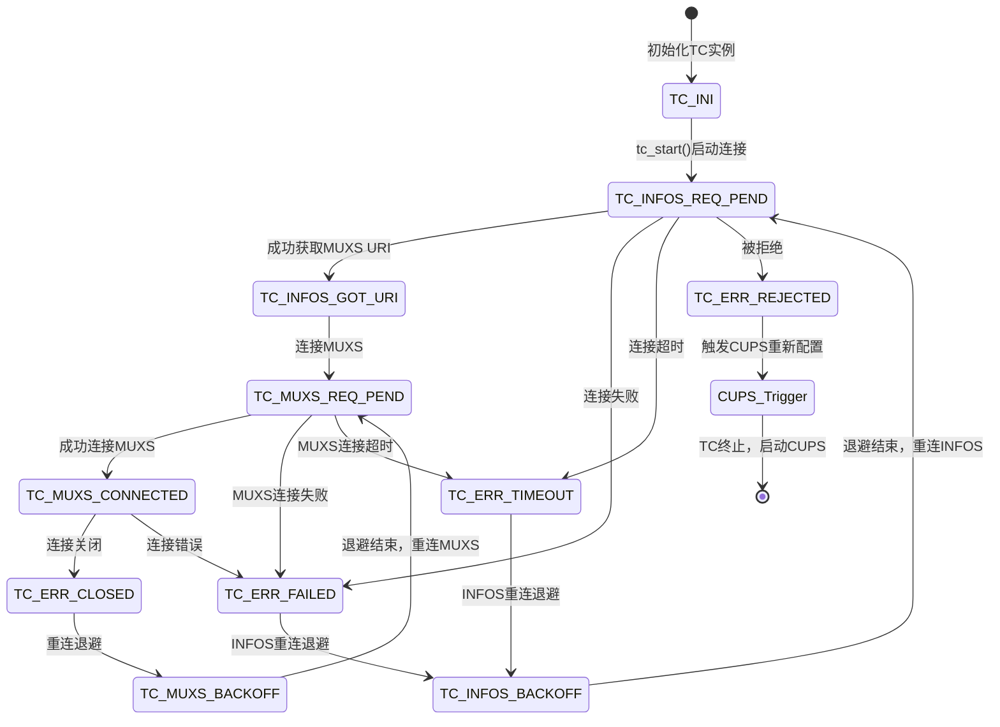
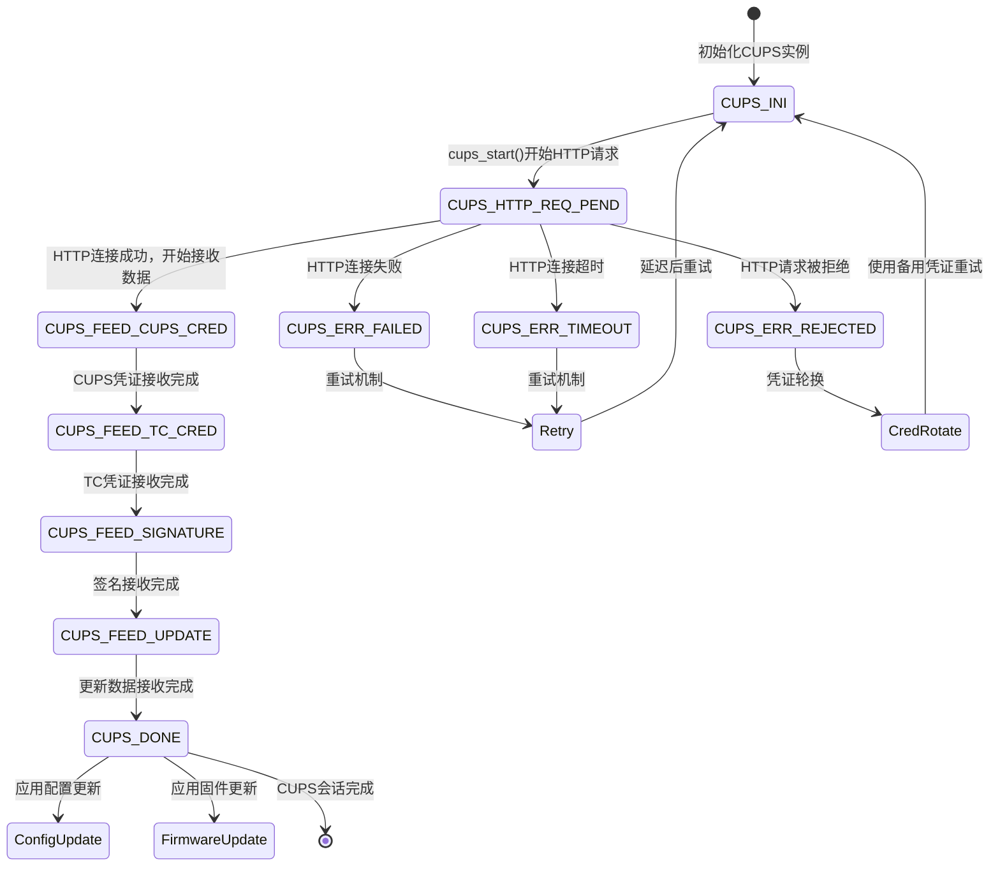
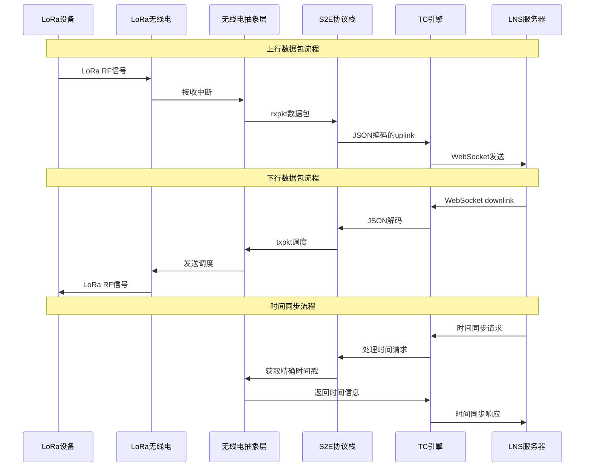
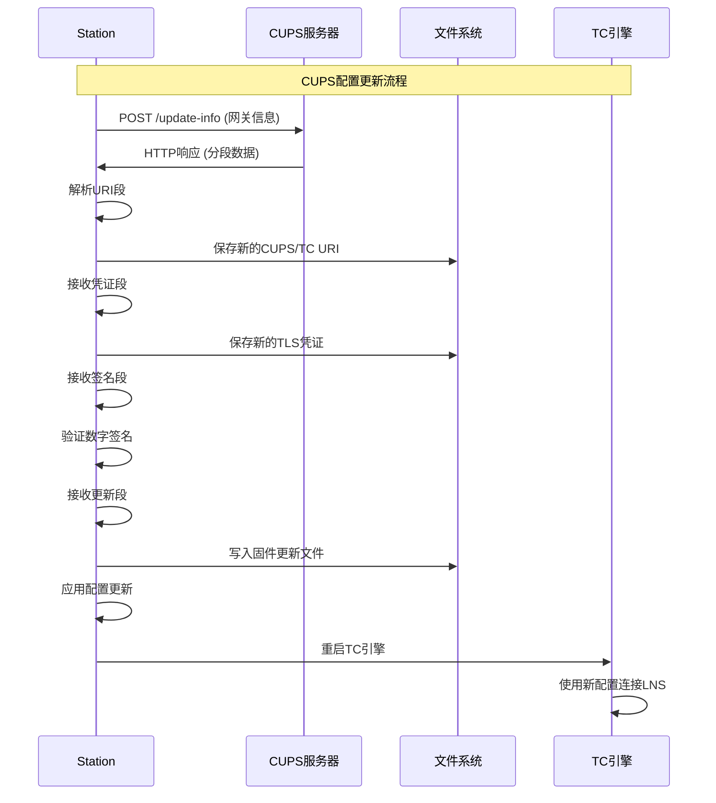
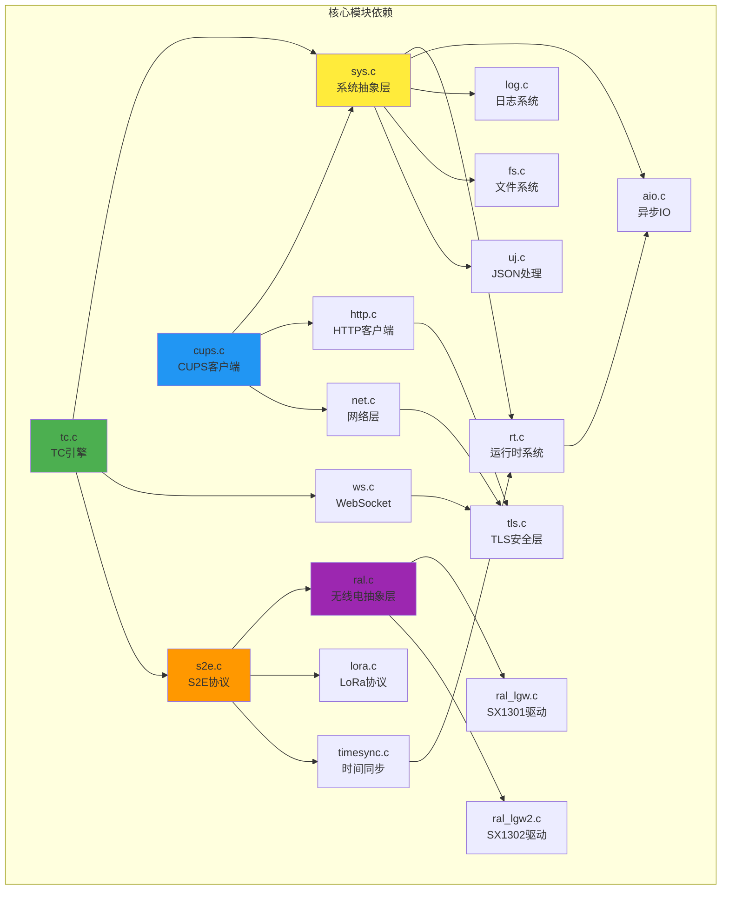
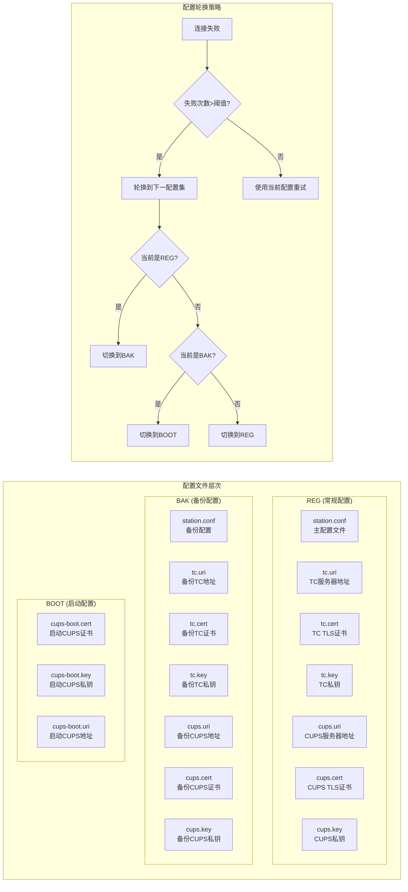

# LoRa Basics Station 系统架构和数据流图

## 系统总体架构图

```mermaid
graph TB
    subgraph "LoRa Basics Station 系统架构"
        subgraph "应用层 (Application Layer)"
            Main[main函数入口]
            SysMain[sys_main主函数]
            Daemon[守护进程管理]
        end

        subgraph "网络协议层 (Network Protocol Layer)"
            TC[TC引擎<br/>Traffic Concentrator]
            CUPS[CUPS客户端<br/>Configuration & Update]
            WebSock[WebSocket协议栈]
            HTTP[HTTP客户端]
            TLS[TLS/SSL安全层]
        end

        subgraph "系统服务层 (System Service Layer)"
            Logging[日志系统]
            Config[配置管理]
            Update[更新管理]
            TimeSync[时间同步]
            FileSystem[文件系统]
        end

        subgraph "运行时层 (Runtime Layer)"
            RT[运行时系统]
            AIO[异步IO系统]
            Timer[定时器系统]
            Memory[内存管理]
        end

        subgraph "硬件抽象层 (Hardware Abstraction Layer)"
            RAL[无线电抽象层]
            SX1301[SX1301驱动]
            SX1302[SX1302/Corecell驱动]
            PicoCell[PicoCell USB驱动]
            GPIO[GPIO控制]
        end

        subgraph "物理层 (Physical Layer)"
            LoRaRadio[LoRa无线电模块]
            GPS[GPS模块]
            LED[状态LED]
            SPI[SPI接口]
            USB[USB接口]
        end
    end

    subgraph "外部系统 (External Systems)"
        LNS[LoRaWAN<br/>Network Server]
        CUPSServer[CUPS<br/>Configuration Server]
        LoRaDevices[LoRa终端设备]
        NTPServer[NTP时间服务器]
    end

    %% 主要数据流连接
    Main --> SysMain
    SysMain --> Daemon
    SysMain --> TC
    SysMain --> CUPS
    
    TC --> WebSock
    CUPS --> HTTP
    WebSock --> TLS
    HTTP --> TLS
    
    TC --> LNS
    CUPS --> CUPSServer
    
    TC --> Config
    CUPS --> Config
    CUPS --> Update
    
    Config --> FileSystem
    Update --> FileSystem
    Logging --> FileSystem
    
    TC --> AIO
    CUPS --> AIO
    AIO --> RT
    
    TimeSync --> NTPServer
    TimeSync --> GPS
    
    RAL --> SX1301
    RAL --> SX1302
    RAL --> PicoCell
    
    SX1301 --> LoRaRadio
    SX1302 --> LoRaRadio
    PicoCell --> LoRaRadio
    
    LoRaRadio --> LoRaDevices
    
    GPIO --> LED
    SX1301 --> SPI
    SX1302 --> SPI
    PicoCell --> USB

    classDef appLayer fill:#e1f5fe
    classDef netLayer fill:#f3e5f5
    classDef sysLayer fill:#e8f5e8
    classDef rtLayer fill:#fff3e0
    classDef halLayer fill:#fce4ec
    classDef phyLayer fill:#f1f8e9
    classDef extSys fill:#fff8e1

    class Main,SysMain,Daemon appLayer
    class TC,CUPS,WebSock,HTTP,TLS netLayer
    class Logging,Config,Update,TimeSync,FileSystem sysLayer
    class RT,AIO,Timer,Memory rtLayer
    class RAL,SX1301,SX1302,PicoCell,GPIO halLayer
    class LoRaRadio,GPS,LED,SPI,USB phyLayer
    class LNS,CUPSServer,LoRaDevices,NTPServer extSys
```

## TC引擎状态机图

## CUPS协议状态机图

## 数据包流向图

## 配置更新流程图

## 模块依赖关系图

## 关键配置文件结构

这个架构图展示了LoRa Basics Station的完整系统设计，包括：

1. **分层架构**: 从应用层到物理层的清晰分层
2. **状态机**: TC和CUPS的详细状态转换
3. **数据流**: 上行和下行数据包的完整路径
4. **配置管理**: 多层配置文件和故障转移机制
5. **模块依赖**: 各模块间的依赖关系

这种设计确保了系统的高可靠性、可维护性和可扩展性。