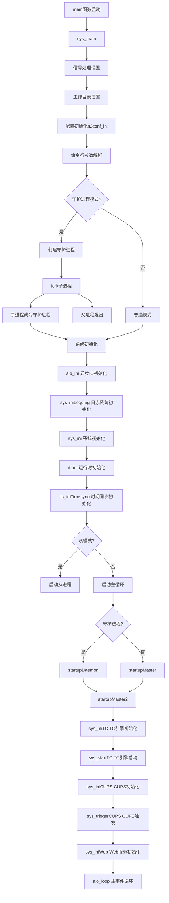

# LoRa Basics Station 项目架构分析

## 项目概述

LoRa Basics Station 是一个功能强大的LoRaWAN网关实现，支持LoRaWAN Classes A、B和C，具有以下核心特性：

- **统一无线电抽象层**：支持多种集中器参考设计
- **强大的后端协议**：支持集中化更新、配置管理、时间同步等
- **精简设计**：无外部软件依赖（除mbedTLS和libloragw），可移植到Linux网关和嵌入式系统

## 程序启动流程图



## 核心模块架构

### 1. 系统层 (System Layer)
- **`sys_linux.c`**: Linux系统特定实现
- **`sys.c`**: 系统抽象层，提供平台无关接口
- **核心功能**：进程管理、文件系统、时间管理、更新管理

### 2. 网络层 (Network Layer)
- **TC (Traffic Concentrator)**: 与LNS(LoRaWAN Network Server)的连接管理
- **CUPS (Configuration and Update Server)**: 配置和更新服务器协议
- **WebSocket**: 实时双向通信协议实现

### 3. 无线电抽象层 (Radio Abstraction Layer)
- **RAL**: 统一的无线电硬件抽象
- **支持多种硬件**：SX1301, SX1302, PicoCell等
- **自动硬件检测和配置**

### 4. 协议栈 (Protocol Stack)
- **S2E**: Station to Engine协议处理
- **LoRa**: LoRa物理层处理
- **时间同步**: GPS和网络时间同步

## 详细启动流程分析

### 阶段1: 初始化 (main → sys_main)

```c
// 程序入口点：src-linux/station_main.c
int main (int argc, char** argv) {
    return sys_main(argc, argv);  // 调用主函数
}
```

### 阶段2: 系统设置 (sys_main开始)

1. **UTC时间偏移设置**
   ```c
   rt_utcOffset = sys_utc() - rt_getTime();
   ```

2. **信号处理配置**
   ```c
   signal(SIGHUP,  SIG_IGN);         // 忽略SIGHUP
   signal(SIGINT,  handle_signal);    // 处理SIGINT(Ctrl+C)
   signal(SIGTERM, handle_signal);    // 处理SIGTERM(终止信号)
   ```

3. **工作目录和配置初始化**
   ```c
   s2conf_ini();                     // 初始化S2配置系统
   setHomeDir(".", "builtin");       // 设置主目录
   setTempDir(...);                  // 设置临时目录
   findDefaultEui();                 // 查找默认EUI
   ```

### 阶段3: 命令行处理

程序支持丰富的命令行选项：
- `-d, --daemon`: 守护进程模式
- `-h, --home`: 配置文件主目录
- `-l, --log-level`: 日志级别
- `-k, --kill`: 终止运行中的进程
- `-f, --force`: 强制接管已运行的实例

### 阶段4: 守护进程模式 (可选)

如果指定了`-d`选项，程序将：
1. 第一次fork创建守护进程
2. 父进程退出，子进程继续
3. 调用`setsid()`脱离控制终端
4. 设置守护进程监控工作进程

### 阶段5: 核心系统初始化

```c
aio_ini();                        // 异步IO系统
sys_iniLogging(&logfile, ...);    // 日志系统
sys_ini();                        // 系统基础设施
rt_ini();                         // 运行时系统
ts_iniTimesync();                 // 时间同步系统
```

### 阶段6: 主循环启动

```c
// 根据模式启动相应的主循环
rt_yieldTo(&startupTmr, daemon ? startupDaemon : startupMaster);
aio_loop();  // 进入异步IO主循环
```

## TC引擎 (Traffic Concentrator Engine)

### 工作流程
1. **连接INFOS服务**: 获取MUXS URI信息
2. **连接MUXS**: 建立与LNS的WebSocket连接
3. **版本协商**: 发送station信息和协议版本
4. **数据转发**: 处理上行和下行LoRa数据包

### 状态机
```c
typedef enum {
    TC_INI = 0,                   // 初始状态
    TC_INFOS_REQ_PEND,           // INFOS请求等待中
    TC_INFOS_GOT_URI,            // 获得MUXS URI
    TC_MUXS_REQ_PEND,            // MUXS连接等待中
    TC_MUXS_CONNECTED,           // 已连接到MUXS
    TC_ERR_TIMEOUT = -1,         // 超时错误
    TC_ERR_FAILED = -2,          // 连接失败
    TC_ERR_CLOSED = -3,          // 连接关闭
    TC_ERR_REJECTED = -4,        // 连接被拒绝
    TC_ERR_NOURI = -5,           // 无URI配置
} tstate_t;
```

## CUPS协议 (Configuration and Update Server)

### 功能特性
- **配置更新**: 自动获取和应用新的网关配置
- **固件更新**: 安全的OTA固件更新机制
- **证书管理**: TLS证书的自动更新和轮换
- **数字签名验证**: 确保更新包的完整性和真实性

### 工作流程
1. **连接CUPS服务器**: 使用HTTP/HTTPS协议
2. **发送网关信息**: 包括EUI、版本、配置CRC等
3. **接收分段数据**:
   - CUPS URI段
   - TC URI段  
   - CUPS凭证段
   - TC凭证段
   - 固件签名段
   - 固件更新段
4. **验证和应用**: 验证签名后应用配置和更新

## 关键数据结构

### TC结构体
```c
typedef struct tc {
    ws_t         ws;              // WebSocket连接
    tmr_t        timeout;         // 超时定时器
    s2ctx_t      s2ctx;          // S2E上下文
    s1_t         tstate;         // TC状态
    int          credset;        // 凭证集
    int          retries;        // 重试次数
    tmrcb_t      ondone;         // 完成回调
    char         muxsuri[MAX_URI_LEN]; // MUXS URI
} tc_t;
```

### CUPS结构体
```c
typedef struct cups {
    http_t       hc;             // HTTP连接
    tmr_t        timeout;        // 超时定时器
    s1_t         cstate;         // CUPS状态
    u1_t         uflags;         // 更新标志
    u1_t         temp[4];        // 临时缓冲区
    u1_t         temp_n;         // 临时缓冲区使用量
    int          segm_len;       // 段长度
    int          segm_off;       // 段偏移
    cups_sig_t*  sig;           // 数字签名
} cups_t;
```

## 配置系统

### 配置文件层次
1. **REG (Regular)**: 常规配置文件
2. **BAK (Backup)**: 备份配置文件  
3. **BOOT**: 启动配置文件

### 配置类型
- **station.conf**: 主配置文件
- **cups-boot.cert**: CUPS TLS证书
- **cups-boot.key**: CUPS TLS私钥
- **tc.cert**: TC TLS证书
- **tc.key**: TC TLS私钥

## 错误处理和重试机制

### 连接重试策略
- **指数退避**: 失败后等待时间逐渐增加
- **配置轮换**: 在REG/BAK/BOOT配置间切换
- **阈值保护**: 达到失败阈值后触发CUPS重新配置

### 日志系统
- **模块化日志**: 不同模块使用不同的日志前缀
- **级别控制**: 支持7个日志级别
- **文件轮换**: 自动日志文件管理

## 性能优化

### 异步IO
- **事件驱动**: 使用epoll/kqueue实现高效IO
- **非阻塞操作**: 避免线程阻塞
- **零拷贝**: 优化数据传输路径

### 内存管理
- **池化分配**: 减少内存碎片
- **引用计数**: 避免内存泄漏
- **延迟释放**: 优化释放时机

这个项目展现了一个工业级LoRaWAN网关的完整实现，具有高可靠性、可扩展性和维护性的特点。